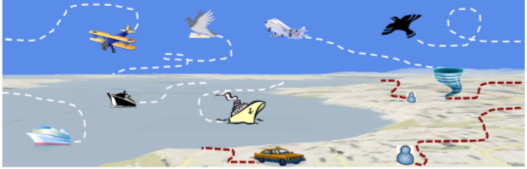
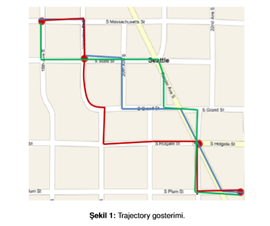
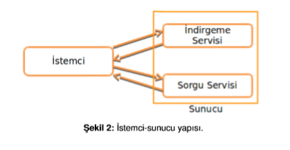
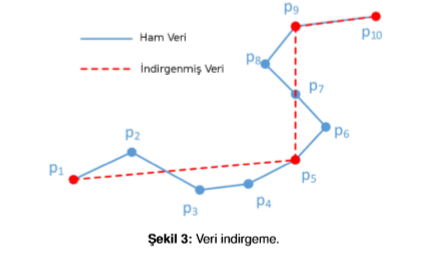

# Gezinge-Trajectory-Verisi-Isleme

## Ekran Görüntüsü


## Problem Tanımı



Haraket eden nesnelerin gerçek zamanlı olarak konum bilgilerinin tespit edilmesi ve
bu konumlar kullanılarak seyahat yollarının (trajectories) olusturulması günümüz
teknolojisinin getirmis oldugu imkanlardan biridir. Bu bilgiler tek basına bir anlam ifade 
etmemekte olup sadace ham veri olarak kalmaktadır. Ancak bu veriler analiz edilerek
bir çok yararlı bilgi elde edebiliriz. Seyahat verilerinden bilgi çıkarımı için bir takım ön
islemler (veri azaltma, filtreleme vs) yapılır. Daha sonra çesitli sorgulamalar yapılabilir.
İleri seviyede ise seyahat verileri üzerinde sınıflandırma, anomali tespiti,
segmentasyon, öneri sistemleri vs gerçekle ¸stirmek mümkündür.Sekil 1’de 3 farklı
kullanıcıya ait trajectory verisi gosterilmistir.



Bu projede, ham trajectory verileri üzerinde veri indirgeme ön islemi ve alan sorgusu
yapan iki servis saglayan bir sunucu ve bu sunucuyu kullanan bir istemci 
gelistirilecektir. Istemci, ham trajectory datasını sunucuya gönderecektir. Sunucu,
aldıgı datayı istenen servise göre isleyip sonucu istemciye gönderecektir (Sekil 2’ye 
bakınız).



• Ham veri bir text dosyasında istemci tarafında tutulmaktadır. Ham gezinge verisi
dosyadan okunup Google, Yahoo gibi harita tabanlı teknojilerden biri ile path
seklinde (datasetteki ardısıl lat-long verilerini line ile birlestirme yoluyla) istemci
arayüzünde gösterilir. Ornegin datasette 10 tane lat-long verisi varsa p1-p2, p2-
p3, . . . ..p9-p10 seklinde birlestirilerek ¸Sekil 3’teki gibi harita uzerinde gosterilir.
Örnek verisetleri: Geolife trajectories, Yonsei dataset veya sizin buldugunuz ˘
herhangi bir veriseti
Örnegin Geolife datasetin herbir satırı 7 farklı alandan olusmaktadır. Biz ilk iki
alanı (lat-long) kullanacagız. Benzer sekilde siz de proje icin lat-long bilgisi
kullanacaksınız.

```sh
39.984702,116.318417,0,492,39744.1201851852,2008-10-23,02:53:04
39.984683,116.31845,0,492,39744.1202546296,2008-10-23,02:53:10
39.984686,116.318417,0,492,39744.1203125,2008-10-23,02:53:15
```
• Istemci ham datayı indirgenmesi icin sunucuya gonderir. “Indirgeme servisi”
yoluyla indirgenen data, indirgeme oranı ve indirgeme süresi istemciye
gönderilir. ˙Indirgenen data harita üzerinde gösterilir. Ayrıca ham datanın da aynı
sekilde baska bir harita uzerinde gosterimi saglanarak birbirlerinden farkı
gosterilebilir olmalıdır. Diger bilgiler (oran, sure) istemci arayuzunde gosterilir.
Sekil 3’te indirgeme olayı resmedilmistir.
Indirgeme oranı= (1-(indirgeme sonrası veri sayısı/ham veri sayısı)) * 100
Çesitli veri indirgeme/basitletirme yaklasımları vardır, arastırarak bir tanesini
seciniz



• Istemci indirgenen ve/veya ham data üzerinde interaktif olarak alan sorgusu
yaparak “Sorgu servisi” nden sorgu alanı içine düsen verileri alır. Sorgu servisi
kendisine gelen verileri once indeksleyerek (Quad-tree, KD-tree, R-tree vs gibi 3
yontemlerle) indeklenmis veri üzerinde sorgu icine dusenler istemciye
gonderilecektir. Burada alan sorgusu, ¸Sekil 4’te kırmızı ile belirtildigi gibi
dikdörtgensel bir sorgudur. Sorgu sonucunda ilgili alan icine dusen veriler
(yesiller) istemciye geri donmelidir. Istemci tarafında harita uzerinde sorgu alanı
icine dusen veriler gosterilebilmelidir.

• Soket, XML-RPC, SOAP, Web Servisleri, DCOM/CORBA RPC, JSON-RPC,
RMI gibi teknolojilerden yararlanarak ¸Sekil 2’deki mimarinin gerceklestirilmesi
saglanacaktır.

• Uygulama, web veya masaüstü projesi olarak tasarlanabilir. Istenilen
programlama dili kullanılabilir.

• Sunum; proje ekibindeki bir bilgisayar istemci, digeri sunucu olacak ¸sekilde
alınacaktır.
